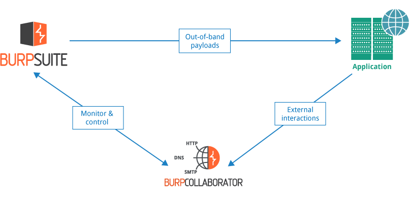
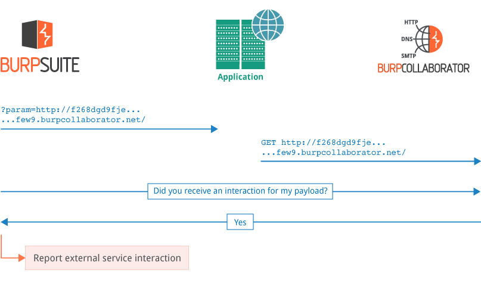
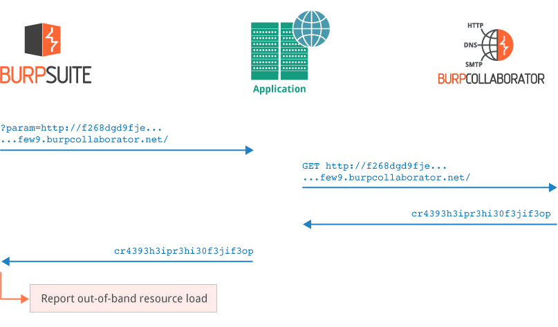
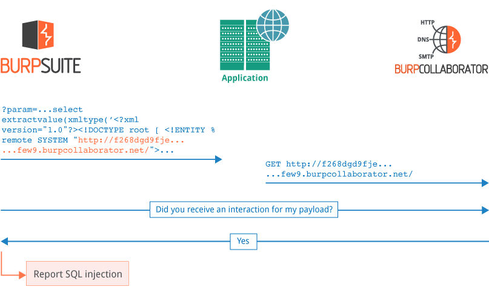
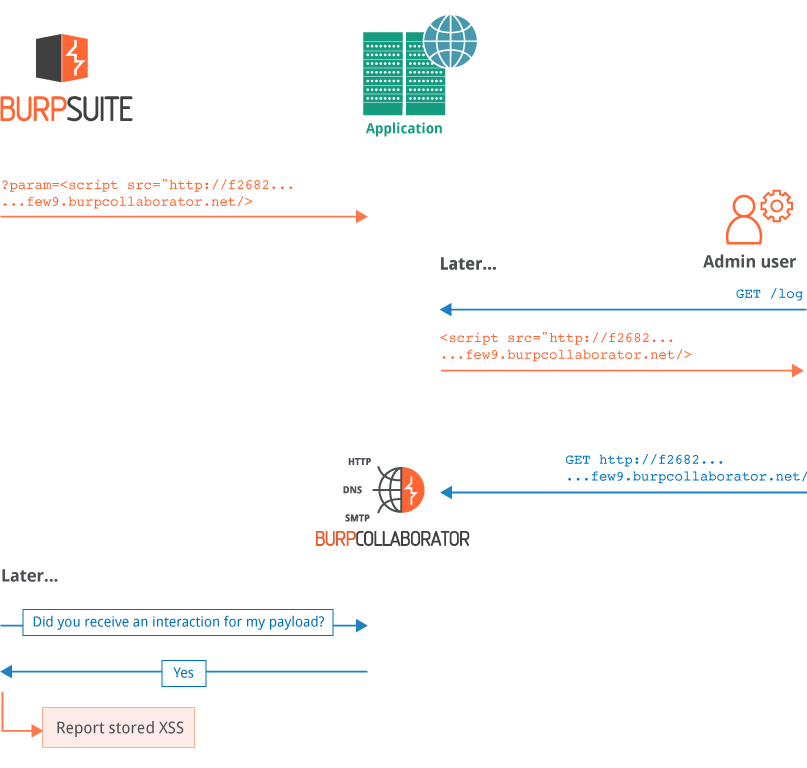

<!doctype html>
<html>
<head>
<meta charset="utf-8">
<meta http-equiv="x-ua-compatible" content="ie=edge">
<meta name="viewport" content="width=device-width, initial-scale=1">
<link rel="stylesheet" href="../../../styles/css/ps.css">
</head>
<body>
<section class="container ps-breadcrumbs">
    <ol>
        <li>
            <a href="https://support.portswigger.net/">Support Center</a>
        </li>
        <li>
            <a href="../index.html">Documentation</a>
        </li>
        <li>
            <a href="index.html">Burp Collaborator</a>
        </li>
    </ol>
</section>
<section class="container edition-labels">
	Professional
</section>
<section class="maincontainer">
    

        <h1>Burp Collaborator</h1>

            This section contains information about <a href="#what-is-burp-collaborator">What Burp Collaborator is</a>, <a href="#how-burp-collaborator-works">How Burp Collaborator works</a>, <a href="#security-of-collaborator-data">Security of data processed by
                Burp Collaborator</a>, and <a href="#options-for-using-burp-collaborator">Options for using Burp Collaborator</a>.
        

        <h2 id="what-is-burp-collaborator">What Is Burp Collaborator?</h2>
        

            Burp Collaborator is a network service that Burp Suite uses to help discover many kinds of vulnerabilities.
            For example:
        

        <ul>
            
            <li>
                Some injection-based vulnerabilities can be detected using payloads that trigger an interaction with an
                external system when successful injection occurs. For example, some blind SQL injection vulnerabilities
                cannot be made to cause any difference in the content or timing of the application's responses, but they
                can be detected using payloads that cause an external interaction when injected into a SQL query.
            </li>
            <li>
                Some service-specific vulnerabilities can be detected by submitting payloads targeting those services to
                the target application, and analyzing the details of the resulting interactions with a collaborating
                instance of that service. For example, mail header injection can be detected in this way.
            </li>
            <li>
                Some vulnerabilities arise when an application can be induced to retrieve content from an external system and process it in some way. For example, the application might retrieve the contents of a supplied URL and include it in its own response.
            </li>
        </ul>
        

            When Burp Collaborator is being used, Burp sends payloads to the application being audited that are designed to
            cause interactions with the Collaborator server when certain vulnerabilities or behaviors occur. Burp
            periodically polls the Collaborator server to determine whether any of its payloads have triggered
            interactions:
        

        
        

            Burp Collaborator is used by <a href="../scanner/index.html">Burp Scanner</a> and the <a href="../desktop/tools/collaborator-client.html">manual Burp Collaborator client</a>, and can also be used by the <a href="../desktop/tools/extender.html#burp-extender-api">Burp Extender API</a>.
        

        <h2 id="how-burp-collaborator-works">How Burp Collaborator Works</h2>
        

            Burp Collaborator runs as a single server that provides custom implementations of various network
            services:
        

        <ul>
            <li>
                It uses its own dedicated domain name, and the server is registered as the authoritative DNS server for
                this domain.
            </li>
            <li>
                It provides a DNS service that answers any lookup on its registered domain (or subdomains) with its own
                IP address.
            </li>
            <li>
                It provides an HTTP/HTTPS service, and uses a valid, CA-signed, wildcard SSL certificate for its domain
                name.
            </li>
            <li>
                It provides an SMTP/SMTPS service.
            </li>
        </ul>
        

            Below are some examples of issues that can be detected via Burp Collaborator.
        

        <h4>Detecting external service interaction </h4>
        

            A typical external service interaction issue can be detected as follows:
        

        <ul>
            <li>
                Burp sends a payload to the application containing a URL that uses a random subdomain of the
                Collaborator domain, for example: 
                param=http://f294gchg2la...r9gf.burpcollaborator.net/
            </li>
            <li>
                Due to its programmed behavior (intended or otherwise), the application fetches the contents of the URL.
                To do this, it will first perform a DNS lookup on the random subdomain, and then perform an HTTP
                request.
            </li>
            <li>
                The DNS lookup and the HTTP request are received by the Collaborator server. Both interactions contain
                the random data that Burp placed into the Collaborator subdomain.
            </li>
            <li>
                Burp polls the Collaborator server and asks: "Did you receive any interactions for my payload?", and the
                Collaborator returns the interaction details.
            </li>
            <li>
                Burp reports the external service interaction to the Burp user, including the full interaction messages
                that were captured by the Collaborator server.
            </li>
        </ul>

<h4>Detecting out-of-band resource load</h4>

    Out-of-band resource load happens when an application can be induced to load content from an arbitrary external source, and include it in its own response. Burp Suite can detect this issue by inducing the Collaborator server to return specific data in its responses to the external interactions, and analysing the application's in-band response for that same data:

		<h4>Detecting blind SQL injection</h4>
		

		    Burp can submit injection-based payloads designed to trigger an external interaction when the injection
		    is successful, enabling the detection of completely blind injection vulnerabilities. The following example uses an Oracle-specific API to trigger an interaction when we successfully inject into a SQL statement:
	    

		
		<h4>Detecting blind cross-site scripting</h4>
		

		    The Collaborator server can notify Burp of deferred interactions that occur asynchronously following
		    submission of the relevant in-band payload to the target. This enables the detection of various stored
		    vulnerabilities, such as second-order SQL injection and blind XSS. In the example below, Burp Suite submits a stored XSS payload designed to trigger a Collaborator interaction if it is ever rendered to a user. Later, an admin user views the payload, and their browser performs the interaction. Later still, Burp Suite polls the Collaborator server, receives details of the interaction, and reports the stored XSS vulnerability:
	    

		
        <h2 id="security-of-collaborator-data">Security of Collaborator Data</h2>
        

            Users may have legitimate concerns about the security of data that is processed by the Collaborator server,
            and the feature has been designed with a strong emphasis on the security of this data.
        

        <h4>What Data Does the Collaborator Server Store?</h4>
        

            In most cases, when a vulnerability is found, the Collaborator server will not receive enough information to
            identify the vulnerability. It does not see the HTTP request that was sent from Burp to the target
            application. In a typical case, it will record that an interaction was received from somewhere, including a
            random identifier that was generated by Burp. Occasionally, the Collaborator server will receive some
            application-specific data: for example, the contents of an email generated through a user registration
            form.
        

        <h4>How is Retrieval of Collaborator Data Controlled?</h4>
        

            The Collaborator functionality is designed so that only the instance of Burp that generated a given payload
            is able to retrieve the details of any interactions that result from that payload. This requirement is
            implemented as follows:
        

        <ul>
            <li>
                Each instance of Burp generates a securely random secret.
            </li>
            <li>
                Each Collaborator-related payload that Burp sends to the target application includes a random identifier
                that is derived from a one-way hash (cryptographic checksum) of the secret.
            </li>
            <li>
                Any resulting interactions with the Collaborator will include this identifier in the transmitted data
                (for example, in the subdomain of a DNS lookup, or the Host header of an HTTP request).
            </li>
            <li>
                The secret is only ever sent by Burp to the Collaborator server, to poll for details of the resulting
                interactions. This is done using HTTPS, unless overridden in Burp's options.
            </li>
            <li>
                When the Collaborator server receives a polling request, it performs the one-way hash of the submitted
                secret, and retrieves the details of any recorded interactions containing identifiers that are derived
                from that hash.
            </li>
            <li>
                Hence, only the instance of Burp that generated the secret is able to retrieve the details of any
                interactions that are triggered by its payloads.
            </li>
        </ul>
        

            Further to this mechanism, the following precautions are also implemented in the Collaborator server to
            protect against unauthorized access to its data:
        

        <ul>
            <li>
                Details of interactions are stored in ephemeral process memory only.
            </li>
            <li>
                No data of any kind is in recorded in any persistent form: for example, a database or log file.
            </li>
            <li>
                Details of interactions are typically retrieved by Burp shortly after they occur, and are then discarded
                by the server.
            </li>
            <li>
                Details of old interactions that have not been retrieved by Burp are discarded after a fixed interval.
            </li>
            <li>
                There is no administrative function for viewing interaction details, only the retrieval mechanism
                already described.
            </li>
            <li>
                The Collaborator server does not by design receive any data that could be used to identify any
                individual Burp user (such as an account name or license key).
            </li>
        </ul>
        <h2 id="options-for-using-burp-collaborator">Options for Using Burp Collaborator</h2>
        

            Burp users can choose between the following three options for using Burp Collaborator:
        

        <ul>
            <li>
                <strong>Public Collaborator server</strong> - This is a server provided by PortSwigger that is shared
                between all Burp users who use it. If the public Collaborator server suffers from any service outage or
                degradation, then the efficacy of Collaborator-related functionality within Burp may be impaired. For
                this reason, PortSwigger makes no warranty about the availability or performance of this server.
            </li>
            <li>
                <strong>Private Collaborator server</strong> - Anyone with a Burp Suite Professional license can run
                their own instance of the Collaborator server. To do this fully effectively, you will need a host
                server, a dedicated domain name, and a valid CA-signed wildcard SSL certificate. Private Collaborator
                servers without a suitable domain name or SSL certificate will be able to support some, but not all, of
                the Collaborator-related capabilities within Burp. You can protect your private Collaborator instance at
                the network layer: you can configure different network interfaces to receive interactions and answer
                polling requests, and you can apply whatever IP restrictions you want, given the locations of your
                targets and testers. The option to use a private Collaborator server is likely to appeal to penetration
                testing firms and in-house security teams. It can also enable individual testers to deploy a
                Collaborator instance when testing on private closed networks with no Internet access. See the
                documentation on <a href="deploying.html">deploying a private Collaborator server</a> for
                more details.
            </li>
            <li>
                <strong>No Collaborator server</strong> - You can configure Burp not to use any Collaborator server.
                With this option, none of the Collaborator-related capabilities within Burp will be available.
            </li>
        </ul>
        

            

                <strong>Note:</strong> The functionality of Burp Collaborator gives rise to issues that require careful
                consideration by users. Users should ensure that they fully understand the functionality and the
                alternative methods of utilization of Burp Collaborator, and have considered the consequences of
                utilization for themselves and their organization.
            

        

        

            Within Burp Suite Professional, you can configure these settings within the <a href="../desktop/options/misc-project.html#burp-collaborator-server"> Burp Collaborator server options</a>.
        

    

</section>
</body>
</html>