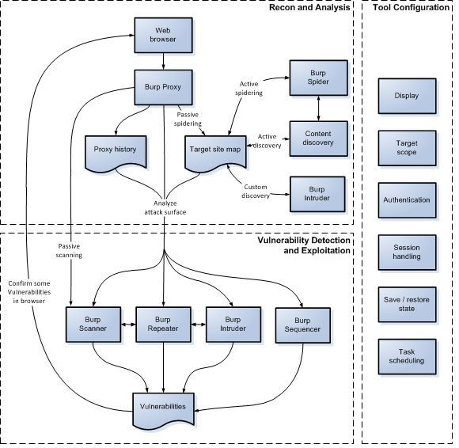

<!doctype html>
<html>
<head>
<meta charset="utf-8">
<meta http-equiv="x-ua-compatible" content="ie=edge">
<meta name="viewport" content="width=device-width, initial-scale=1">
<link rel="stylesheet" href="../../../../styles/css/ps.css">
</head>
<body>
<section class="container ps-breadcrumbs">
    <ol>
        <li>
            <a href="https://support.portswigger.net/">Support Center</a>
        </li>
        <li>
            <a href="../../index.html">Documentation</a>
        </li>
        <li>
            <a href="../index.html">Desktop Editions</a>
        </li>
        <li>
            <a href="index.html">Penetration Testing</a>
        </li>
    </ol>
</section>
<section class="container edition-labels">
	Professional&nbsp;Community
</section>
<section class="maincontainer">
    

        <h1>Penetration Testing</h1>

            The sections below describe the essentials of how to use Burp Suite within your web application testing. For
            much more information about general techniques and methodologies for web application testing, please refer
            to <a href="http://mdsec.net/wahh/">The Web Application Hacker's Handbook</a>, which was co-authored by
            the creator of Burp Suite.
        

            

                Also in the <a href="https://support.portswigger.net/">Burp Suite Support Center</a>:
            

            <ul class="link-list">
                <li>
                    <a href="https://support.portswigger.net/customer/portal/topics/720229-using-burp-suite/articles"> Using Burp Suite</a>
                </li>
            </ul>
        

		
		
        <h2 id="the-basics-of-using-burp">The Basics of Using Burp</h2>
        

            For help with installing and launching Burp, starting projects, and configuring display settings, please see the help on <a href="../getting-started/index.html">Getting started with Burp Suite</a>.
        

        

            To use Burp for penetration testing, you need to <a href="configuring-your-browser.html">configure your browser</a> to work with Burp, and <a href="../tools/proxy/options/installing-ca-certificate.html">install Burp's CA
            certificate</a> in your browser.
        

        

            Once you have Burp running and configured your browser, go to the Proxy Intercept tab, and ensure that interception is turned on (if the button
            says "Intercept is off" then click it to toggle the interception status). Then go to your browser and visit
            any URL.
        

        

            Each HTTP request made by your browser is displayed in the Intercept tab. You can view each message, and
            edit it if required. You then click the "Forward" button to send the request on to the destination web
            server. If at any time there are intercepted messages pending, you will need to forward all of these in
            order for your browser to complete loading the pages it is waiting for. You can toggle the "Intercept is on
            / off" button in order to browse normally without any interception, if you require. For more help, see <a href="../tools/proxy/getting-started.html">Getting started with Burp Proxy</a>.
        

        

            As you browse an application via Burp, the Proxy history keeps a record of all requests and responses. In
            the Proxy, go to the History tab and review the series of requests you have made. Select an item in the
            table and view the full messages in the Request and Response tabs.
        

        

            Also, as you browse, Burp by default builds up a site map of the target application. Go to the Target tab, and the Site
            Map sub-tab, to view this. The site map contains all of the URLs you have visited in your browser, and also
            all of the content that Burp has inferred from responses to your requests (e.g. by parsing links from HTML
            responses). Items that have been requested are shown in black, and other items are shown in gray. You can
            expand branches in the tree, select individual items, and view the full requests and responses (where
            available). For more help, see <a href="../tools/target/using.html"> Using the Target tool</a>. You can control which content gets added to the site map as you browse, by configuring a suitable <a href="../scanning/live-scans.html">live scanning task</a>.
        

        

            At the
            core of Burp's penetration testing workflow is the ability to pass HTTP requests between the Burp tools, to carry
            out particular tasks. You can send messages from the Proxy intercept tab, the Proxy history, the site map,
            and indeed anywhere else in Burp that you see HTTP messages. To do this, select one or more messages, and
            use the context menu to send the request to another tool.
        

        

            

                The Burp tools you will use for particular tasks are as follows:
            

            <ul>
                
                <li>
                    <strong><a href="../../scanner/index.html">Scanner</a></strong> - This is used to automatically
                    scan websites for content and security vulnerabilities.
                </li>
                <li>
                    <strong><a href="../tools/intruder/getting-started.html">Intruder</a></strong> - This allows you to perform
                    customized automated attacks, to carry out all kinds of testing tasks.
                </li>
                <li>
                    <strong><a href="../tools/repeater/using.html">Repeater</a></strong> - This is used to manually modify and
                    reissue individual HTTP requests over and over.
                </li>
                <li>
                    <strong><a href="../tools/collaborator-client.html">Collaborator client</a></strong> - This is used to generate Burp Collaborator payloads and monitor for resulting out-of-band interactions.
                </li>
                <li>
                    <strong><a href="../tools/clickbandit.html">Clickbandit</a></strong> - This is used to generate clickjacking exploits against vulnerable applications.
                </li>
                <li>
                    <strong><a href="../tools/sequencer/getting-started.html">Sequencer</a></strong> - This is used to analyze the
                    quality of randomness in an application's session tokens.
                </li>
                <li>
                    <strong><a href="../tools/decoder.html">Decoder</a></strong> - This lets you transform bits of application
                    data using common encoding and decoding schemes.
                </li>
                <li>
                    <strong><a href="../tools/comparer.html">Comparer</a></strong> - This is used to perform a visual comparison
                    of bits of application data to find interesting differences.
                </li>
            </ul>
        

        

            You can combine Burp's different tools in numerous ways, to perform testing tasks ranging from very simple
            to highly advanced and specialized.
        

        <h2 id="testing-workflow">Testing Workflow</h2>
        

            Burp lets you combine manual
            and automated techniques effectively, gives you complete control over all of the actions that Burp performs,
            and provides detailed information and analysis about the applications you are testing.
        

        

            Some users may not wish to use Burp in this way, and only want to perform a quick and easy vulnerability
            scan of their application. If this is what you need, please refer to <a href="../scanning/index.html">Scanning web sites</a>.
        

        

            The diagram below is a high-level overview of the key parts of Burp's penetration testing workflow:
        

        
        <h2 id="recon-and-analysis">Recon and Analysis</h2>
        

            The <a href="../tools/proxy/using.html">Proxy tool</a> lies at the heart of Burp's workflow. It lets you use your
            browser to navigate the application, while Burp captures all relevant information and lets you easily
            initiate further actions. In a typical test, the recon and analysis phase involves the tasks described below.
        

        <h3>Manually map the application</h3>
        

            Using your browser working through Burp Proxy, <a href="../tools/target/using.html#manual-application-mapping">manually map the application</a> by following links,
            submitting forms, and stepping through multi-step processes. This process will populate the Proxy <a href="../tools/proxy/using.html#using-the-proxy-history">history</a> and Target <a href="../tools/target/site-map/index.html">site map</a> with all of the content requested, and (via <a href="../scanning/live-scans.html">live scanning</a>)
            will add to the site map any further content that can be inferred from application responses (via links,
            forms, etc.). You should then <a href="../tools/target/using.html#reviewing-unrequested-items"> review any unrequested
                items</a> (shown in gray in the site map), and request these using your browser.
        

        <h3>Perform automated mapping where necessary</h3>
        

            You can optionally use Burp to automate the
            mapping process in various ways. You can:
        

        <ul>
            <li>
                Carry out <a href="../scanning/index.html">automated scanning</a> to crawl the application's content.
            </li>
            <li>
                        Use the <a href="../functions/content-discovery.html"> content discovery</a> function to find
                        further content that is not linked from visible content that you can browse to or spider.
                    </li>
                    <li>
                        Perform <a href="../tools/intruder/using.html#enumerating-identifiers"> custom discovery</a> using Burp
                        Intruder, to cycle through lists of common files and directories, and identify hits.
                    </li>
        </ul>
        

            Note that before performing any automated actions, it may be necessary to update various aspects of
            Burp's <a href="#tool-configuration">configuration</a>, such as <a href="../tools/target/using.html#defining-target-scope">target scope</a> and <a href="../options/sessions/index.html">session handling</a>.
        

        <h3>Analyze the application's attack surface</h3>
        

            The process of mapping the application
            populates the Proxy <a href="../tools/proxy/using.html#using-the-proxy-history">history</a> and Target <a href="../tools/target/site-map/index.html">site map</a> with all the information that Burp has captured about the
            application. Both of these repositories contain features to <a href="../tools/proxy/using.html#using-the-proxy-history">help
                you</a> <a href="../tools/target/using.html#analyzing-the-attack-surface">analyze</a> the information they contain, and assess
            the attack surface that the application exposes. Further, you can use Burp's <a href="../functions/target-analyzer.html">Target Analyzer</a> to report the extent of the attack
            surface and the different types of URLs the application uses.
        

        <h2 id="tool-configuration">Tool Configuration</h2>
        

            Burp contains a wealth of <a href="../options/index.html">configuration options</a>, which it is often necessary to
            use at different stages of your testing, to ensure that Burp works with your target application in the way
            you require. For example:
        

        <ul>
            <li>
                <strong>Display</strong> - You can configure the <a href="../options/display.html#http-message-display">font</a> and <a href="../options/display.html#character-sets">character set</a> used to display HTTP messages, and also
                the <a href="../options/display.html#user-interface"> font</a> in Burp's own UI.
            </li>
            <li>
                <strong>Target scope</strong> - The <a href="../tools/target/scope.html"> target scope</a> configuration tells
                Burp the items that you are currently interested in and willing to attack. You should configure this
                early in your testing, as it can control which items are displayed in the Proxy <a href="../tools/proxy/history.html#proxy-history-display-filter">history</a> and Target <a href="../tools/target/site-map/index.html#site-map-display-filter">site
                    map</a>, which messages are <a href="../tools/proxy/options/index.html#intercepting-http-requests-and-responses">intercepted</a> in the Proxy, and
                which items may be <a href="../scanning/index.html">scanned</a>.
            </li>
            <li>
                <strong>Platform authentication</strong> - If the application server employs any platform level (HTTP)
                authentication, you configure Burp to handle the <a href="../options/connections.html#platform-authentication">authentication</a> automatically.
            </li>
            <li>
                <strong>Session handling</strong> - Many applications contain features that can hinder automated or
                manual testing, such as reactive session termination, use of per-request tokens, and stateful
                multi-stage processes. You can <a href="../options/sessions/index.html">configure Burp</a> to handle most of
                these situations seamlessly, using a combination of <a href="../options/sessions/index.html#session-handling-rules">session
                handling rules</a> and <a href="../options/sessions/index.html#macros">macros</a>.
            </li>
            
            <li>
                <strong>Task scheduling</strong> - You can configure Burp to <a href="../functions/task-scheduler.html">schedule tasks</a> at given times or intervals, to allow
                you to work within specified testing windows.
            </li>
        </ul>
        <h2 id="vulnerability-detection-and-exploitation">Vulnerability Detection and Exploitation</h2>
        

            After completing your <a href="#recon-and-analysis">recon and analysis</a> of the target application, and any necessary <a href="#tool-configuration">configuration</a> of Burp, you can begin probing the application for common
            vulnerabilities. At the stage, it is often most effective to use several Burp tools at once, passing
            individual requests between different tools to perform different tasks, and also going back to your browser
            for some tests. Throughout Burp, you can use the <a href="../functions/message-editor/index.html#context-menu-commands">context
            menu</a> to pass items between tools and carry out other actions.
        

        

            In Burp's default configuration, it automatically performs <a href="../scanning/live-scans.html">live passive scanning</a> of all requests and responses
            that pass through the Proxy. So before you begin actively probing the application, you might find that Burp
            Scanner has already recorded some <a href="../tools/target/site-map/index.html#issues-view"> issues</a> that warrant closer
            investigation.
        

        

            Burp's tools can be used in numerous different ways to support the process of actively testing for
            vulnerabilities. Some examples are described below for different types of issues.
        

        <h3>Input-based bugs</h3>
        

            For issues like SQL injection, cross-site scripting, and file path
            traversal, you can use Burp in various ways:
        

        <ul>
            <li>
                You can perform <a href="../scanning/index.html">scans</a> using Burp Scanner.
                You can select items anywhere in Burp, and <a href="../scanning/index.html#launching-scans">initiate
                    scans</a> using the context menu. Or you can configure Burp to do <a href="../scanning/live-scans.html">live scanning</a> of all in-scope
                requests passing through the Proxy.
            </li>
            <li>
                        You can use Burp Intruder to perform <a href="../tools/intruder/using.html#fuzzing-for-vulnerabilities">fuzzing</a>,
                        using your own test strings and payload positions.
                    </li>
                    <li>
                        You can send individual requests to <a href="../tools/repeater/using.html">Burp Repeater</a>, to manually
                        modify and reissue the request over and over.
                    </li>
                    <li>
                        Having identified some types of bugs, you can actively exploit these using <a href="../tools/intruder/using.html">Burp Intruder</a>. For example, you can often use the <a href="../tools/intruder/payloads/types.html#recursive-grep">recursive grep</a> payload type to exploit
                        SQL injection vulnerabilities.
                    </li>
        </ul>
        <h3>Logic and design flaws</h3>
        

            For issues like unsafe use of client-side controls, failure to
            enforce account lockout, and the ability to skip key steps in multi-stage processes, you generally need
            to work manually:
        

        <ul>
                    <li>
                        Typically, a close review of the <a href="../tools/proxy/using.html#using-the-proxy-history">Proxy history</a> will
                        identify the relevant requests that need to be investigated.
            </li>
                    <li>
                        You can then probe the application's handling of unexpected requests by issuing these
                        individually using <a href="../tools/repeater/using.html">Burp Repeater</a>, or by turning on <a href="../tools/proxy/using.html#intercepting-requests-and-responses">Proxy interception</a> and manually changing requests on
                        the fly while using your browser.
                    </li>
                    <li>
                        You can actively exploit many logic and design flaws using <a href="../tools/intruder/using.html"> Burp
                        Intruder</a>. For example, Intruder can be used to enumerate valid usernames, guess passwords,
                        cycle through predictable session tokens or password recovery tokens, or even simply to reissue
                        the same request a large number of times (using the <a href="../tools/intruder/payloads/types.html#null-payloads">null payloads</a> type).
                    </li>
                    <li>
                        Having confirmed a logic or design flaw, many of these can be actively exploited by using Burp
                        Proxy's <a href="../tools/proxy/options/index.html#match-and-replace">match/replace function</a>, or <a href="../options/sessions/index.html#session-handling-rules"> session handling rules</a>, to change requests in
                        systematic ways.
                    </li>
        </ul>
            <h3>Access control issues</h3>
        

            Burp contains several features that can help when testing for
            access control vulnerabilities:
        

        <ul>
                    <li>
                        You can use the <a href="../tools/target/site-map/comparing.html"> Compare site maps</a> function for
                        various tasks, including: identifying functionality that is visible to one user and not another;
                        testing whether a low privileged user can access functions that should be restricted to higher
                        privileged users; and discovering where user-specific identifiers are being used to segregate
                        access to data by two users of the same type.
            </li>
                    <li>
                        You can use different browsers to access the application in different user contexts, and use a
                        separate <a href="../tools/proxy/options/index.html#proxy-listeners">Burp Proxy listener</a> for each browser (using
                        different ports). You can then open additional <a href="../tools/proxy/history.html">Proxy history</a> windows (via the context menu) and set the <a href="../tools/proxy/history.html#proxy-history-display-filter"> display
                        filter</a> on each window to show only items received on a specific listener port. As you use
                        the application in each browser, each history window will show only the items for the associated
                        user context. You can then use the "Request in browser in current browser session" function (via
                        the context menu) to switch requests between browsers, to determine how they are handled in that
                        browser's user context.
                    </li>
                    <li>
                        Many privilege escalation vulnerabilities arise when the application passes a user identifier in
                        a request parameter, and uses that to identify the current user context. You can actively
                        exploit this type of vulnerability by using <a href="../tools/intruder/using.html"> Burp Intruder</a> to
                        cycle through identifiers in the appropriate format (e.g. using the <a href="../tools/intruder/payloads/types.html#numbers">numbers</a> or <a href="../tools/intruder/payloads/types.html#custom-iterator"> custom iterator</a> payload types) and
                        configuring <a href="../tools/intruder/options.html#grep-extract">extract grep</a> items to retrieve
                        interesting user-specific data from the application's responses.
                    </li>
                </ul>
                    <h3>Other vulnerabilities</h3>
                

                    Burp contains functions that can be used to deliver, and often
                    automate, virtually any task that arises when probing for other types of vulnerabilities. For example:
                

                <ul>
                    <li>
                        You can review the contents of the Target <a href="../tools/target/site-map/index.html">site map</a> for
                        information leakage issues, using the <a href="../functions/search.html#text-search"> Search</a> and <a href="../functions/search.html#find-comments-and-scripts"> Find comments</a> functions to assist you.
                    </li>
                    <li>
                        Having identified a possible CSRF vulnerability, you can use the <a href="../functions/generate-csrf-poc.html">CSRF generator</a> to quickly create a proof-of-concept
                        attack in HTML, then use the "Test in browser" function to load the attack into your browser,
                        and then review the browser results and <a href="../tools/proxy/using.html#using-the-proxy-history"> Proxy history</a> to
                        verify whether the attack was successful.
                    </li>
                    <li>
                        You can use <a href="../tools/sequencer/index.html">Burp Sequencer</a> to analyze a sample of session tokens
                        from the application, and estimate the quality of their randomness.
                    </li>
                    <li>
                        For some types of encrypted session tokens or other parameters, you can use the <a href="../tools/intruder/payloads/types.html#bit-flipper"> bit flipper</a> and <a href="../tools/intruder/payloads/types.html#ecb-block-shuffler"> ECB block shuffler</a> payload types in
                        Burp Intruder to blindly modify the encrypted data in an attempt to meaningfully change the
                        decrypted data that the application processes.
                    </li>
                    <li>
                        You can write your own custom <a href="../tools/extender.html"> Burp extensions</a> to carry out more
                        specialized or customized tasks.
                    </li>
        </ul>
        <h2 id="read-more">Read More</h2>
        

            There is extensive documentation for all of Burp's tools and features, and the typical workflow you need to
            use when testing with Burp.
        

        

            

                Use the links below for help about using each of the main Burp tools:
            

            <ul class="link-list">
                <li>
                    <a href="../tools/target/using.html">Using the Target tool</a>
                </li>
                <li>
                    <a href="../tools/proxy/using.html">Using Burp Proxy</a>
                </li>
                <li>
                    <a href="../tools/intruder/using.html">Using Burp Intruder</a>
                </li>
                <li>
                    <a href="../tools/repeater/using.html">Using Burp Repeater</a>
                </li>
                <li>
                    <a href="../scanning/index.html">Scanning web sites</a>
                </li>
            </ul>
        

    

</section>
</body>
</html>