<!doctype html>
<html>
<head>
<meta charset="utf-8">
<meta http-equiv="x-ua-compatible" content="ie=edge">
<meta name="viewport" content="width=device-width, initial-scale=1">
<link rel="stylesheet" href="../../../styles/css/ps.css">
</head>
<body>
<section class="container ps-breadcrumbs">
    <ol>
        <li>
            <a href="https://support.portswigger.net/">Support Center</a>
        </li>
        <li>
            <a href="../index.html">Documentation</a>
        </li>
        <li>
            <a href="index.html">Scanner</a>
        </li>
        <li>
            <a href="auditing.html">Auditing</a>
        </li>
    </ol>
</section>
<section class="container edition-labels">
    
    &nbsp;
    Professional
</section>
<section class="maincontainer">
    

        <h1>Auditing</h1>
        <h2 id="audit-phases">Audit Phases</h2>
        

            Burp Scanner carries out several distinct audit phases. These are divided into three areas:
        

        <ul>
            <li>
                Passive phases
            </li>
            <li>
                Active phases
            </li>
            <li>
                JavaScript analysis phases
            </li>
        </ul>
        

            Performing multiple phases within each area allows Burp to:
        

        <ul>
            <li>
                Effectively find and exploit functions that store and return user input.
            </li>
            <li>
                Avoid duplication by handling frequently occurring issues and insertion points in an optimal manner.
            </li>
            <li>
                Execute applicable work in parallel to make most efficient use of system resources.
            </li>
        </ul>
<h2 id="issue-types">Issue Types</h2>

    Burp is able to detect a huge variety of issues, including security vulnerabilities and other items of informational interest.

    Issues can be divided into different types according to the nature of the audit activity that is involved in detecting them:

<ul>
    <li>
        Passive - These are issues that can be detected purely by inspecting the application's normal requests and responses. For example, <a href="https://portswigger.net/kb/issues/00400900_serialized-object-in-http-message">serialized objects in HTTP messages</a>.
    </li>
    <li>
        Light active - These are issues that can be detected by making a small number of benign additional requests. For example, <a href="https://portswigger.net/kb/issues/00200601_cross-origin-resource-sharing-arbitrary-origin-trusted">cross-origin resource sharing (CORS) that trusts arbitrary origins</a>.
    </li>
    <li>
        Medium active - These are issues that can be detected by making requests that the application might reasonably view as malicious. For example, <a href="https://portswigger.net/kb/issues/00100100_os-command-injection">OS command injection</a>.
    </li>
    <li>
        Intrusive active - These are issues that can be detected by making requests that carry a higher risk of damaging the application or its data. For example, <a href="https://portswigger.net/kb/issues/00100200_sql-injection">SQL injection</a>.
    </li>
    <li>
        JavaScript analysis - These are issues that can be detected by analyzing the JavaScript that the application executes on the client side. For example, DOM-based cross-site scripting. Detecting these issues is often resource-intensive on the machine that Burp is running on. These issues can also be categorized as "passive" (for self-contained DOM-based issues) or "medium active" (for reflected and stored variants).
    </li>
</ul>

    Issues can also be divided into different types according to the level at which they are found:

<ul>
    <li>
        Host level - These are issues that arise at the level of the host HTTP service that the application is running on. For example, a permissive <a href="https://portswigger.net/kb/issues/00200400_flash-cross-domain-policy">flash cross-domain policy</a>.
    </li>
    <li>
        Request level - These are issues that arise at the level of an individual request. For example, <a href="https://portswigger.net/kb/issues/00200700_cross-site-request-forgery">cross-site request forgery</a>.
    </li>
    <li>
        Insertion point level - These are issues that arise at the level of an insertion point within a request. For example, <a href="https://portswigger.net/kb/issues/00100300_file-path-traversal">file path traversal</a>.
    </li>
</ul>
<h2 id="insertion-points">Insertion Points</h2>

    Burp Scanner uses the concept of insertion points to place payloads into different locations within requests. In general, an insertion point represents a piece of data within a request that might be specifically processed by the server-side application. The following example shows a request with some common types of insertion points highlighted:

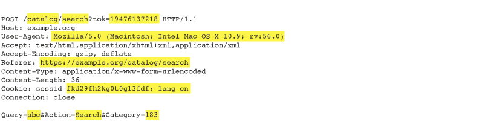

    Burp Scanner audits insertion points individually, sending payloads to each insertion point in turn to test the application's handling of that input.

<h3 id="encoding-data-within-insertion-points">Encoding Data Within Insertion Points</h3>

    Different locations within an HTTP request typically need to have their data encoded in different ways. Burp Scanner automatically applies suitable encoding to payloads based on the type of the insertion point, to ensure that the raw payloads reach the relevant application functions. For example, different encoding is applied to standard body parameters:

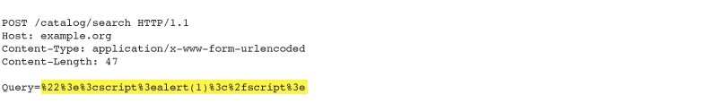

    to parameters within JSON data:

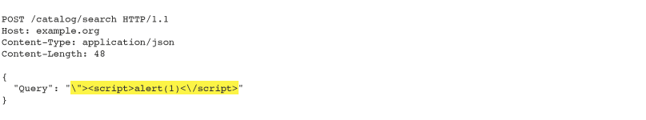

    and to parameters within XML data:

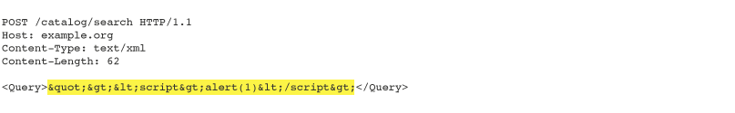

    Burp Scanner also detects when an application is using other types of encoding that are not tied to the insertion point type, such as Base64:

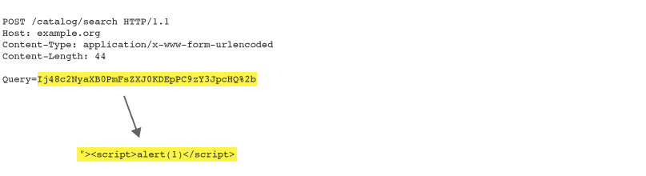
<h3 id="nested-insertion-points">Nested Insertion Points</h3>

    Some applications apply multiple layers of encoding to the same data, effectively nesting one format within another. Burp Scanner is able to detect this behavior, and automatically applies the same layers of encoding to payloads:

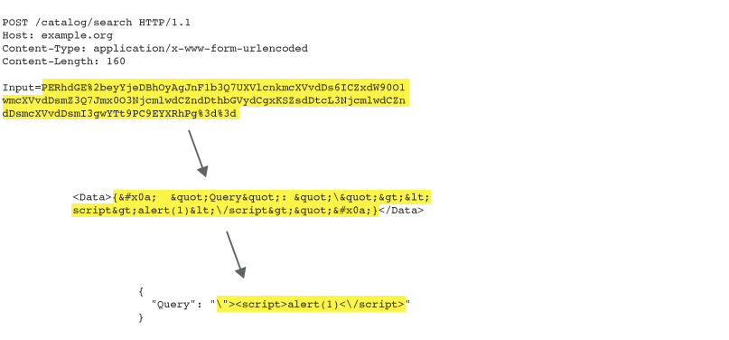
<h3 id="modifying-parameter-locations">Modifying Parameter Locations</h3>

    Some applications place a certain piece of input into one type of parameter, but will in fact process the input if it is submitted in a different type of parameter. This happens because some platform APIs that applications use to retrieve input from requests are agnostic as to the type of parameter that is holding the input. However, some protections in place around an application, such as web application firewalls, might only apply to the original parameter type.

    Burp can optionally exploit this behavior by changing the parameter types of insertion points, to create requests that might bypass protections and reach vulnerable application functionality. For example, if a payload is submitted within a URL query string parameter, Burp might also submit corresponding payloads within a body parameter and a cookie:

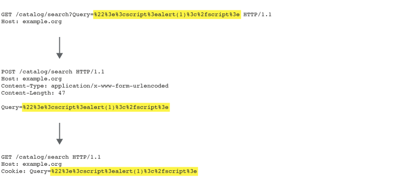
<h2 id="automatic-session-handling">Automatic Session Handling</h2>

    When Burp Scanner's audit follows on from an automated crawl, it is able to make use of the crawl results to automatically maintain session during the audit, with zero configuration by the user.

    When Burp performs an audit of an individual request, it begins by identifying the shortest path to reach that request from the starting location of the crawl:

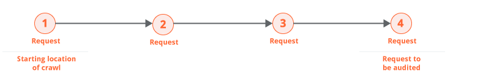

    Burp then determines the most efficient way to deliver that same request repeatedly within a valid session. It does this by first rewalking the path to obtain a fresh sample of any session tokens, and then testing various simplifications of the path to see if the session is correctly maintained.

    In many cases, it is possible to simply reissue the final request over and over. This can happen because the request doesn't actually contain any session tokens at all:

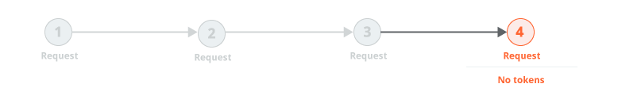

    Or because the only session tokens are cookies, which can typically be used multiple times:

    Or because, although the request contains both cookies and CSRF tokens, the CSRF tokens can be used repeatedly:

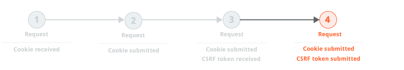

    In some cases, it is necessary to issue the preceding request on each occasion prior to issuing the request that is being audited. This normally happens because the application uses single-use CSRF tokens. Because the tokens are single-use, it is necessary to reissue the preceding request on each occasion, to obtain a fresh token.

    In extreme cases, every transition between requests is protected by a single-use token. This happens occasionally in high-security applications where navigation is tightly controlled. In this situation, the most reliable way to repeatedly issue the request to be audited is to always return to the starting location and walk the full path to that request:

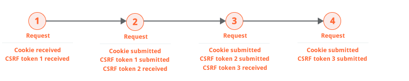

    Once Burp has determined the most efficient way to repeatedly issue the request that is to be audited, it carries out the audit. While carrying out its various audit checks, Burp periodically monitors the application's responses to ensure that a valid session is maintained. If Burp positively confirms the validity of the session, then it sets a checkpoint on the audit checks that have been fully completed. If Burp identifies that the session is no longer valid, it rolls back to the latest checkpoint and resumes from there. This logic is carried out in a way that minimizes the overhead of session management and avoids indefinite loops if sessions are frequently lost. For example:

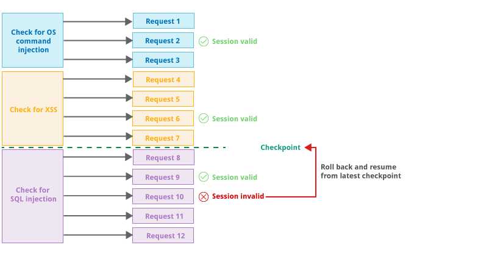
<h2 id="avoiding-duplication"> Avoiding Duplication</h2>

    Burp Scanner uses various techniques to minimize duplicated effort and reporting of duplicate issues.

<h3 id="consolidation-of-frequently-occurring-passive-issues">Consolidation of frequently occurring passive issues</h3>

    Some passively-detected issues are liable to exist at many different locations within an application, due to a chosen approach to development or a reused page template (for example, cross-site request forgery or cross-domain script include). Some issues will even exist across the entire application due to a platform-level configuration (for example, strict transport security not enforced). In this situation, Burp Scanner will by default avoid generating duplicated issues by aggregating these and reporting a single issue at the applicable level, which might be the web root of the host or a particular folder beneath which all of the issues are found.

<h3 id="handling-of-frequently-occurring-insertion-points">Handling of frequently occurring insertion points </h3>

        Some insertion points are liable to exist within many or all requests used by the application, but might not represent interesting attack surface. Examples of this are cookies which, once set, are submitted within every subsequent request, and cachebuster parameters which are placed into URL query strings to prevent caching but are not processed by the server-side application. Performing a full audit of these insertion points in every request could represent a considerable overhead of redundant work. In this situation, Burp Scanner will by default identify insertion points that have proven to be uninteresting (occurring frequently without any issues generated) and will drop to performing a more lightweight audit of those insertion points. If the lightweight audit identifies any interesting behavior that indicates server-side processing, then Burp will continue and perform a full audit of the insertion point as normal.
    

<h2 id="javascript-analysis"> JavaScript Analysis</h2>

    Burp Scanner analyzes JavaScript contained within application responses, to identify a wide range of DOM-based vulnerabilities. To do this, it uses a combination of static and dynamic analysis:

<ul>
    <li>
        Static analysis - This parses the JavaScript code to construct an abstract syntax tree (AST). It identifies the tainted sources that are potentially controllable by an attacker, and the dangerous sinks that could be used to perform an attack. It analyzes the possible data flows through the code to identify potential paths via which malicious data could be propagated from a tainted source to a dangerous sink.
    </li>
    <li>
        Dynamic analysis - This loads the response into an embedded headless browser. It injects payloads into the DOM at locations that are potentially controllable by an attacker, and executes the JavaScript within the response. It also interacts with the page by creating mouse events to achieve as much code coverage as possible (in onclick event handlers etc.). It monitors the dangerous sinks that could be used to perform an attack, to identify any injected payloads that reach those sinks.
    </li>
</ul>

    The static and dynamic approaches have different inherent strengths and weaknesses:

<ul>
    <li>
        Static analysis is able to find some vulnerabilities that dynamic analysis misses, because static analysis can identify code paths that could possibly be executed in the right circumstances, but which are not in fact executed during the dynamic analysis. For example, a branch in execution might be controlled by a number of parameters that the attacker controls. The static analysis is able to identify and analyze this branch and find taint paths within it, while the dynamic analysis might not trigger the relevant execution due to the actual combination of parameters that it uses. However, static analysis is inherently prone to false positive results, because it might see some combinations of code branches as executable when they are in fact not, and because it fails to understand custom data validation logic that means taint paths from sources to sinks are not in fact exploitable.
    </li>
    <li>
        Dynamic analysis has the opposite characteristics. It is much less prone to false positives because if it actually observes suitable tainted data being propagated from source to sink during execution, then this behavior is concrete evidence for a vulnerability. However, it can suffer from false negatives in situations where the tainted data that it injects doesn't reach a sink due to the current state of the application or the values of other data, both of which an attacker might in fact be able to control.
    </li>
</ul>

    Burp Scanner harnesses the joint benefits of the static and dynamic approaches. Where possible, it correlates the results of the two techniques, and reports issues with evidence obtained using both. These issues may be regarded as rock-solid findings, and are reported as certain. In cases where only static analysis can detect a potential issue, Burp downgrades the confidence with which the issue is reported. This integrated approach to JavaScript analysis greatly assists a tester who is reviewing the results to find the most important issues.

<h2 id="handling-application-errors">Handling application errors</h2>

    Performing a full audit of a web application can be an invasive process, and it is common to encounter problems like connection failures, transmission timeouts, or outages of back-end components while a scan is in progress. Additionally, protections like web application firewalls might selectively drop connections based on specific payloads, or even based on any unexpected values in certain parameter values.

    During the audit process, Burp tracks the occurrence of error conditions in as granular a way as possible. If an individual action causes an error, Burp marks that action as failed and moves on to the next action. Optionally, if repeated actions fail at the same level of activity, then that whole level is marked as failed. So Burp will progressively mark as failed: individual audit checks, then individual insertion points, then the entire request being audited, and ultimately the entire scan.

    Since it is common to encounter isolated errors with specific audit requests, Burp will initially capture details of the error and continue scanning. When the whole audit is complete, Burp can optionally perform a number of follow-up passes to retry failed operations. This can be useful in cases where a particular application component (such as a back-end database) experienced a problem for part of the scan. Burp can also optionally pause or abort the scan if too many errors are observed, so that the user can investigate the problem and resume or repeat the scan when the application is stabilized.

    

</section>
</body>
</html>