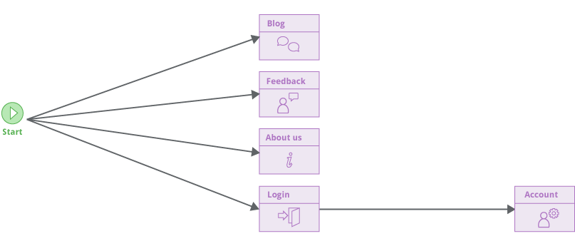
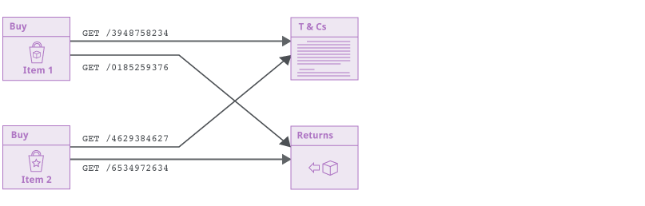
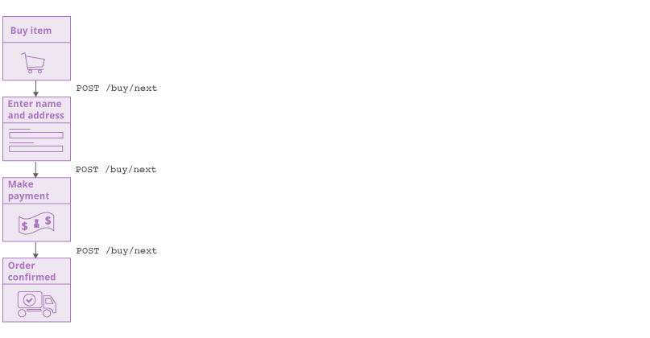
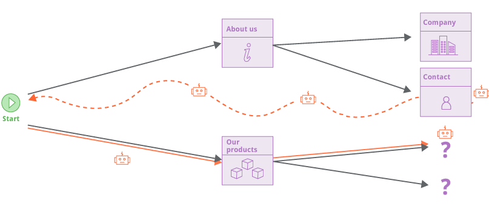
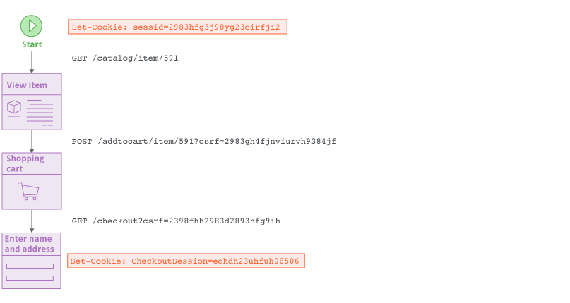
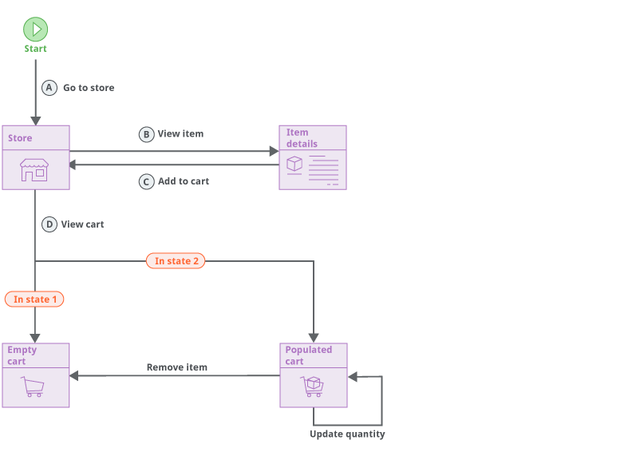
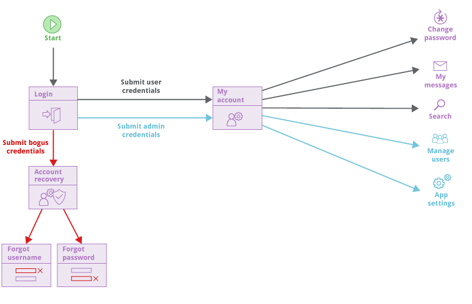
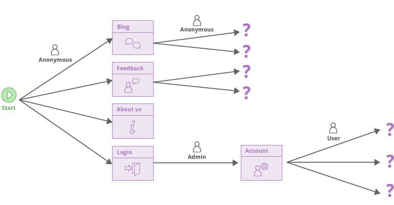
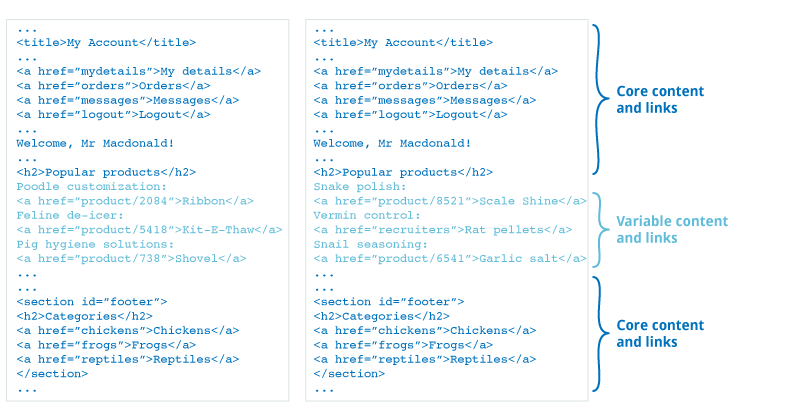
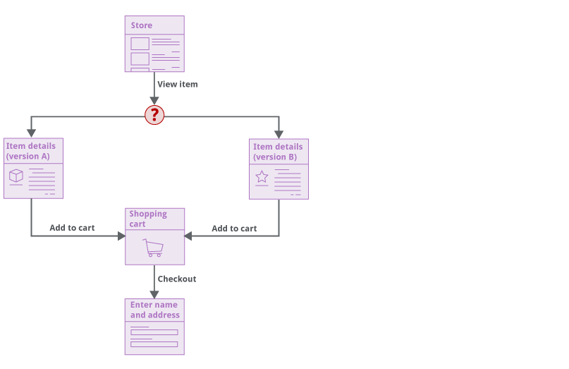

<!doctype html>
<html>
<head>
<meta charset="utf-8">
<meta http-equiv="x-ua-compatible" content="ie=edge">
<meta name="viewport" content="width=device-width, initial-scale=1">
<link rel="stylesheet" href="../../../styles/css/ps.css">
</head>
<body>
<section class="container ps-breadcrumbs">
    <ol>
        <li>
            <a href="https://support.portswigger.net/">Support Center</a>
        </li>
        <li>
            <a href="../index.html">Documentation</a>
        </li>
        <li>
            <a href="index.html">Scanner</a>
        </li>
        <li>
            <a href="crawling.html">Crawling</a>
        </li>
    </ol>
</section>
<section class="container edition-labels">
    
    &nbsp;
    Professional
</section>
<section class="maincontainer">
    

        <h1>Crawling</h1>
        <h2 id="core-approach">Core Approach</h2>
        

            Burp's crawler navigates around a target application in the same way as a user with a browser, by clicking links and submitting input. It constructs a map of the application's content and functionality in the form of a directed graph, representing the different locations in the application and the links between those locations:
        

        
        
        

            The crawler makes no assumptions about the URL structure used by the application. Locations are identified (and re-identified later) based on their contents, not the URL that was used to reach them. This enables the crawler to reliably handle modern applications that place ephemeral data such as CSRF tokens or cache-busters into URLs. Even if the entire URL within each link changes on every occasion, the crawler still constructs an accurate map:
        

        
        

            The approach also allows the crawler to handle applications that use the same URL to reach different locations, based on the state of the application or the user's interaction with it:
        

        
        

            As the crawler navigates around and builds up coverage of the target application, it tracks the edges in the graph that have not been completed. These represent the links (or other navigational transitions) that have been observed within the application but not yet visited. But the crawler never&nbsp;"jumps" to a pending link and visits it out of context. Instead, it either navigates directly from its current location, or reverts to the start location and navigates from there. This replicates as closely as possible the actions of a normal user with a browser:
        

        
        

            Crawling in a way that makes no assumptions about URL structure is highly effective in dealing with modern web applications, but can potentially lead to problems in seeing "too much" content. Modern web sites often contain a mass of superfluous navigational paths (via page footers, burger menus, etc.), meaning that everything is directly linked to everything else. Burp's crawler employs a variety of techniques to address this issue: it builds up fingerprints of links to already visited locations to avoid visiting them redundantly; it crawls in a breadth-first order that prioritizes discovery of new content; and it has configurable cut-offs that constrain the extent of the crawl. These measures also help to deal correctly with "infinite" applications, such as calendars.
        

        <h2 id="session-handling">Session Handling </h2>
        

            Because Burp's crawler navigates around a target application in the same way as a user with a browser, it is able to automatically work with practically any session-handling mechanism that browsers are able to deal with. There is no need to record macros or configure session handling rules telling Burp how to obtain a session or verify that the current session is valid.
        

        

            The crawler employs multiple crawler "agents" to parallelize its work. Each agent represents a distinct user of the application navigating around with their own browser. Each agent has its own cookie jar, which is updated when the application issues it with a cookie. When an agent returns to the start location to begin crawling from there, its cookie jar is cleared, to simulate a completely fresh browser session.
        

        

            The requests that the crawler makes as it navigates around are constructed dynamically based on the preceding response, so CSRF tokens in URLs or form fields are handled automatically. This allows the crawler to correctly navigate functions that use complex session-handling, with zero configuration by the user:
        

        
        <h2 id="detecting-changes-in-application-state">Detecting Changes in Application State</h2>
        

            Modern web applications are heavily stateful, and it is common for the same application function to return different content on different occasions, as a result of actions that were performed by the user in the meantime. Burp's crawler is able to detect changes in application state that result from actions that it has performed during crawling.
        

        

            In the example below, navigating the path BC causes the application to transition from state 1 to state 2. Link D goes to a logically different location in state 1 versus state 2. So the path AD goes to the empty cart, while ABCD goes to the populated cart. Rather than just concluding that link D is non-deterministic, the crawler is able to identify the state-changing path that link D depends on. This allows the crawler to reliably reach the populated cart location in future, to access the other functions that are available from there:
        

        
        <h2 id="application-login">Application Login</h2>
        

            Burp's crawler begins with an unauthenticated phase in which no credentials are submitted. When this is complete, Burp will have discovered any login and self-registration functions within the application.
        

        

            If the application supports self-registration, Burp will attempt to register a user. You can also configure the crawler to use one or more pre-existing logins.
        

        

            The crawler then proceeds to an authenticated phase. It will visit the login function multiple times and submit:
        

        <ul>
            <li>
                The credentials for the self-registered account (if any).
            </li>
            <li>
                The credentials for each configured pre-existing account.
            </li>
            <li>
                Bogus credentials (these might reach interesting functions such as account recovery).
            </li>
        </ul>
        

            For each set of credentials submitted to the login, Burp will then crawl the content that is discovered behind the login. This allows the crawler to capture the different functions that are available to different types of user:
        

        
        

            Although the crawler normally employs multiple crawler agents in parallel, some applications prohibit concurrent login by the same user. In this situation when a user logs in, any existing authenticated session for the same user is terminated. Burp is able to detect this behavior, and will only perform a single concurrent login for each distinct user account:
        

        
        <h2 id="crawling-volatile-content">Crawling Volatile Content</h2>
        

            Modern web applications frequently contain volatile content, where the "same" location or function will return responses that differ substantially on different occasions, not (necessarily) as the result of any action by the user. This behavior can result from factors such as feeds from social media channels or user comments, inline advertising, or genuinely randomized content (message of the day, A/B testing, etc.).
        

        

            Burp's crawler is able to identify many instances of volatile content, and correctly re-identify the same location on different visits, despite the differing responses. This allows the crawler to focus attention on the "core" elements within a set of application responses, which is likely to be the most important in terms of discovering the key navigational paths to interesting application content and functionality:
        

        
        

            In some cases, visiting a given link on different occasions will return responses that just differ too much to be treated as the "same". In this situation, Burp's crawler will capture both versions of the response as two different locations, and will plot a non-deterministic edge in the graph. Provided the extent of non-determinism across the application is not too great, Burp can still crawl the associated content, and reliably find its way to content that is behind the non-deterministic link:
        

            

</section>
</body>
</html>